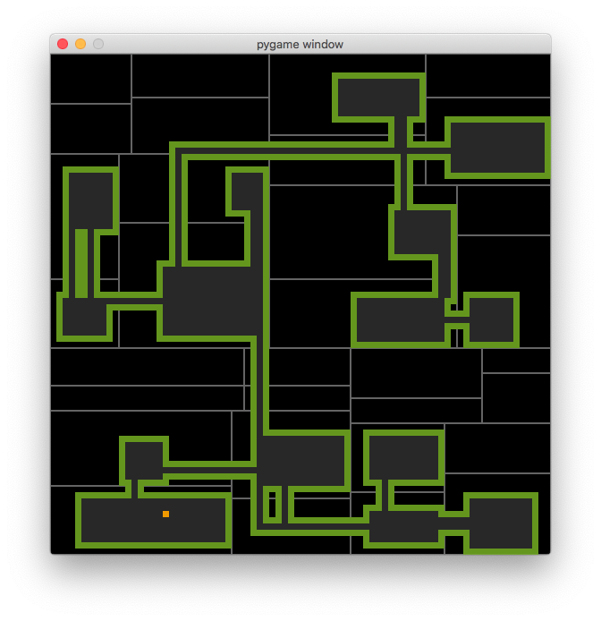

**WIP** This is not finished yet. The dungeons are created, but with some bugs.

This is a poc for creating procedurally generated dungeons using [BSP](https://en.wikipedia.org/wiki/Binary_space_partitioning) as described on [rogue basin](http://www.roguebasin.com/index.php?title=Basic_BSP_Dungeon_generation).

There are two scripts you can run:

`test.py` which uses tiles from Kenney's [1-bit pack](https://www.kenney.nl/assets/bit-pack) and lets you walk with a character inside the dungeons. Keys:

* Move with `up`, `down`, `left`, `right`.
* `d` to toggle debug info.
* 'g' to toggle ghost mode (let's you stand in any tile of the level)

`test_generator.py`: Creates the dungeon and shows a blueprint and the partitions from the BSP. Keys:

* `l` Loads the dungeon from `level.json`.
* `s` Save the dungeon to `level.json`.
* `g` Creates a new dungeon.
* `a` Toggles the option to create one dungeon after another. If the dungeon doesn't meet certain requeriments, it stops and marks each error encountered with a red circle in the level.
* `mouse` Shows which tile is selected by the mouse.

